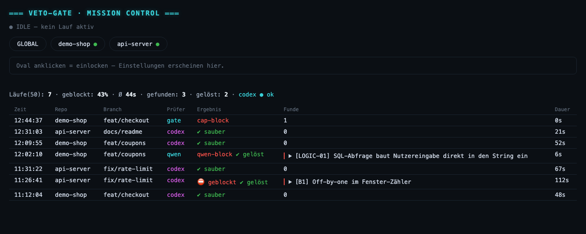

<p align="center">
  
</p>

# veto-gate

**A second reviewer in front of every `git commit`.** The diff goes to an LLM
before the commit lands; when it finds a real problem, the commit is blocked
with an explanation instead of a score. Built for
[Claude Code](https://claude.com/claude-code) on macOS.

## Install

Three lines. One of them is a login.

```bash
# 1 — fetch, check, wire in. Asks before installing anything.
curl -fsSL https://raw.githubusercontent.com/revvax/veto-gate/main/boot.sh | bash

# 2 — the reviewer runs on YOUR account. veto-gate pays for nothing.
codex login

# 3 — switch it on where you want it. Until you do, nothing happens anywhere.
cd your-project && veto-gate enable
```

That is the whole setup. `boot.sh` checks what is missing, names the command
that fixes it, clones into `~/.veto-gate` and wires the hook into
`~/.claude/settings.json`. It never installs behind your back, and an
unattended run answers every prompt with *no* rather than *yes*.

**Did it work?**

```bash
veto-gate doctor        # every required line ✓ ?
```

Then make a small commit in an enabled repo — the gate speaks up before it goes
through. `veto-gate` without arguments shows the runs live. `veto-gate disable`
turns one repo off again.

Rather not pipe a script into your shell? Download `boot.sh`, read it, run it —
or do the same by hand:

```bash
git clone https://github.com/revvax/veto-gate.git
cd veto-gate && ./install.sh
```

Step by step, including Windows/WSL and the usual pitfalls:
**[docs/INSTALL.md](docs/INSTALL.md)**.

---

## What it actually does

Before a commit lands, veto-gate packs the staged diff into a review bundle and
walks it through a chain of stages. Anything can stop the commit; the cheap
deterministic stages run first, so an obvious problem never costs an LLM call:

| Stage | Costs | Blocks when |
|---|---|---|
| size | nothing | the commit is larger than `max_lines` and should be split |
| grounding | nothing | the diff imports or calls something that does not exist |
| tests | nothing | the tests belonging to the changed files fail — **off by default**, since running them means executing your project's code; allow a repo by adding its path to `~/.claude/config/test-allowlist` |
| pre-checker | free tier / local | an obvious mistake is found before the paid reviewer sees it |
| main reviewer | your codex account | a real problem is found in the diff |
| kreisel brake | nothing | the same fix has failed three rounds in a row |

The verdict is not a score. It is a list of findings, each with what is wrong,
why it matters and a concrete fix — and the commit stays blocked until they are
addressed or you deliberately override.

One caveat worth knowing up front: **the standard integration covers commits
from Claude Code sessions** (via the hook in `settings.json`). If a bare
`git commit` in a terminal should be reviewed too, run `veto-gate
install-precommit` in that repo to add a real git hook.

## Configuration (`.claude/config/veto-gate.json`)

`veto-gate enable` creates this file and merges into an existing one. Everything
else is optional:

| Field | Meaning | Default |
|---|---|---|
| `enabled` | Gate on/off for this repo | `false` |
| `max_lines` | Commit line limit above which the commit must be split (docs don't count) | `300` |
| `effort` | Codex reasoning depth (`low`\|`medium`\|`high`) | `medium` |
| `plan_review` | Treat plan documents (`docs/**/*.md`) as a design review instead of a code review | `false` |
| `prechecker` | Pre-checker (`none`\|`qwen`\|`groq`\|`gemini`) | `none` |

The old file name `veto2.json` and old `VETO2_*` variables keep working
transitionally (rename 2026-07: `veto2` → `veto-gate`).

## Dashboard (web panel)

`veto-gate serve` starts a local panel on `http://localhost:4003`
(localhost only; write access additionally token-protected): recent runs,
findings with their reasoning and whether they were resolved, plus
per-repo settings one click away.



*Demo data — this is what it looks like when a pre-checker (`qwen`) and
the main reviewer (`codex`) report findings and the next round resolves
them.*

---

## Plugging in your own LLMs

Three plug-in points. Only the first is mandatory, and it already works after
`codex login` — skip this whole section unless you want to change something.

### 1. Main reviewer (required) — default: codex CLI

The last reviewer before every commit. The default and only bundled
integration is the **OpenAI Codex CLI** — you need your own account
(`codex login`); veto-gate does not pay for anything on your behalf.
Without a reachable main reviewer the gate blocks **every** commit
(fail-closed).

To be honest: replacing the main reviewer means plugging in your own CLI.
It has to do two things: read the diff bundle (a directory containing
`REVIEW_PROMPT.md` and the diff) and answer with EXACTLY ONE verdict JSON,
at minimum with the `blocking` field (the full schema is part of the
prompt, generated by `hooks/lib/veto-gate/pack-diff.sh`; the invocation
lives in `hooks/lib/veto-gate/codex-diff-review.sh`). There is no
ready-made switch for this (yet).

### 2. Local pre-checker (optional) — any OpenAI-compatible endpoint

A local model sees the diff first and blocks the obvious mistakes without
burning Codex quota. `"qwen"` here is a fixed config keyword, not a model
requirement — you always write it literally, no matter which model you
actually run. Any OpenAI-compatible server works; LM Studio and Ollama
below are just the two proven examples. Set `"prechecker": "qwen"` in the
repo, then point the URL/model at whatever you're actually running:

```bash
export VETO_GATE_QWEN_URL="http://127.0.0.1:1234/v1/chat/completions"  # your server
export VETO_GATE_QWEN_MODEL="<your-model>"                             # exact model ID
```

- **LM Studio** (default): start the server, port `1234` — the URL above fits.
- **Ollama**: `VETO_GATE_QWEN_URL="http://127.0.0.1:11434/v1/chat/completions"`,
  model ID as shown by `ollama list`.

The model ID has to match **exactly**: veto-gate only sends the diff to a
server that lists precisely this model under `/v1/models` (the diff may
contain sensitive code). If it does not match, the pre-checker silently
drops out and the main reviewer takes over — it is a cost saver, never a
replacement.

### 3. Remote pre-checker (optional) — Groq / Gemini

Same principle via a free API provider — but unlike the local slot, this
one is **not** open to any provider: Groq and Gemini are the only two
options the code currently understands (`veto-gate key` only accepts
`groq` or `gemini`; no other provider name works here). Store the key
once (input is hidden; the file ends up with `600` permissions outside of
any repo):

```bash
veto-gate key groq      # or: veto-gate key gemini
```

Set `"prechecker": "groq"` (or `"gemini"`) in the repo. Model
placeholders, in case you want a different one:

```bash
export VETO_GATE_GROQ_MODEL="<groq-model>"      # default: llama-3.3-70b-versatile
export VETO_GATE_GEMINI_MODEL="<gemini-model>"  # default: gemini-3.5-flash
```

Use free-tier keys only (Gemini: create the project **without** billing —
otherwise every call costs money; veto-gate cannot technically enforce
this).

## Turning it off / uninstalling

One repo: `veto-gate disable`. Everything:

```bash
./uninstall.sh
```

Removes exactly the symlinks and the one `settings.json` entry that
`install.sh` created. Backups of `settings.json` are left in place.

## What a working day looks like


Three rounds blocked, the fourth clean, and the next commit already knocking.
That is the normal case, not the bad day: over twelve measured days in my own
repos the gate found something worth blocking in **52 % of all work packages**
(208 of 403), and **96 %** of those findings were gone by the next round.

It also costs something, and the log says how much: **72 seconds** per review at
the median, 13.9 hours over those twelve days — and 35 % of commits where I
deliberately stepped around the gate.

## Platforms

Developed and tested on **macOS** (bash 3.2, no GNU coreutils).
**Windows via WSL2 only** — the guide for that lives in
[docs/INSTALL.md](docs/INSTALL.md), but has not yet been verified
end to end on a WSL machine; feedback welcome.

## License

MIT — see `LICENSE`.
